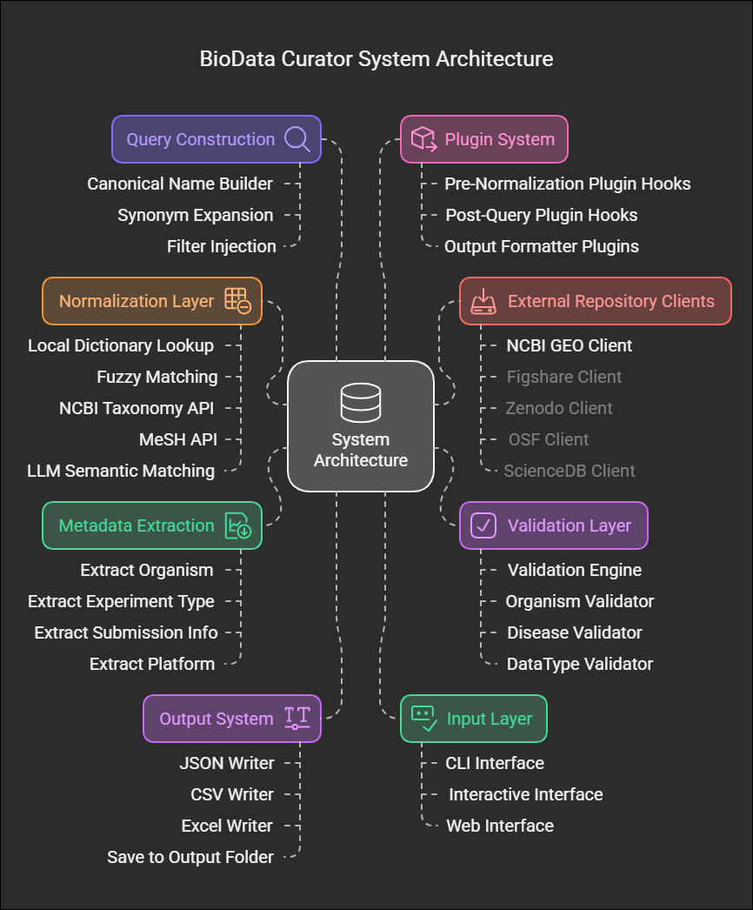
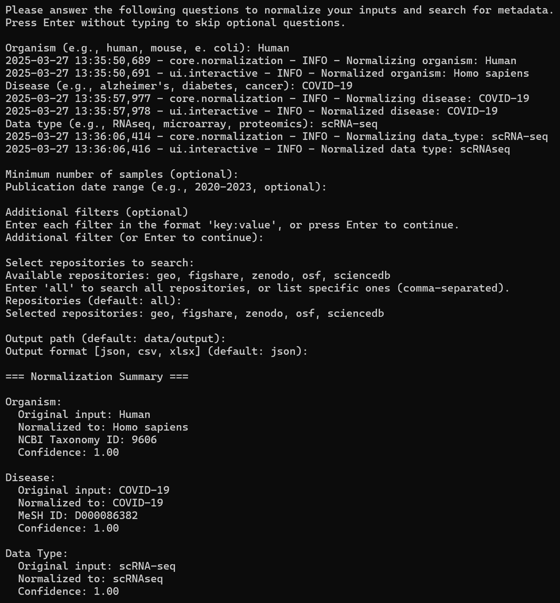
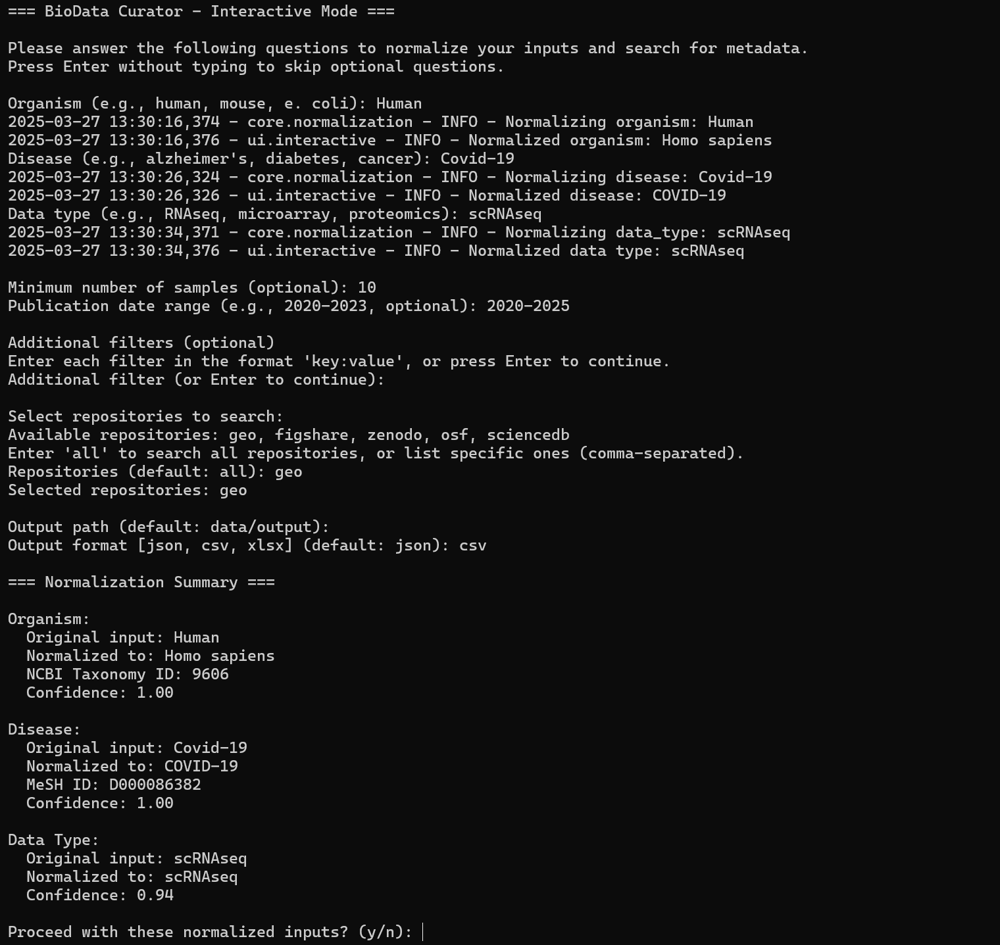
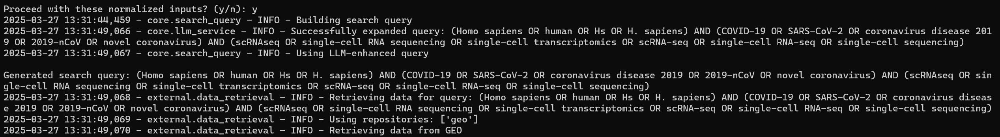
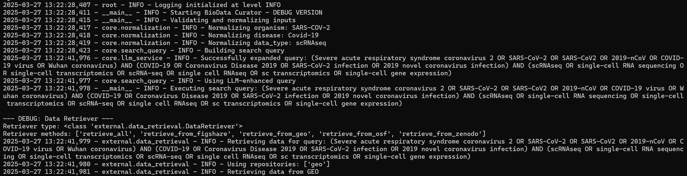

# Curaios - Biological Data Curator
Curaios isn't just a tool. It's a system that understands your research language.

## Authors
Dr Rezwanuzzaman Laskar
Asifuzzaman Laskar


## Introduction
Curaios is an AI-native metadata curation engine that transforms messy biomedical inputs into structured, normalized forms using Large Language Models (LLMs). It converts diverse scientific terminology into standardized database formats through semantic analysis of organism names, disease labels, and data types. By employing contextual understanding rather than simple keyword matching, Curaios ensures more accurate and comprehensive search results across repositories like NCBI GEO, Figshare, OSF, ScienceDB and Zenodo.

## Naming
The name Curaios combines Curation, AI, and the suffix -os (as in “system”)—capturing the idea of of metadata curation, artificial intelligence, and systematic processing that works as a cohesive solution.

## Background
In today’s era of complex biological data and ever-growing public repositories, researchers frequently encounter inconsistent, incomplete, and unstructured metadata when working with public datasets. Inputs are often ambiguous, and repositories vary in their structure, terminology, and formatting. This creates a barrier to effective data discovery and reuse.
At the same time, Large Language Models (LLMs) are changing how we interact with information. In biomedical research, they offer new ways to understand, normalize, and connect complex scientific inputs.
Curaios was built to bridge this gap. Rather than relying on hard-coded rules or static dictionaries, it uses LLMs to interpret user intent, resolve ambiguity, and generate context-aware search queries that reflect how scientists think—not just how databases are structured.

## What Makes Curaios Different:

- 1. Semantic Understanding: Uses transformer models to comprehend scientific concepts, not just match text
- 2. Multi-Strategy Normalization: Cascades through exact matching, APIs, fuzzy matching, and LLMs with intelligent fallbacks
- 3. Context-Aware Processing: Understands relationships between biomedical entities and their hierarchies
- 4. Cross-Repository Search: Queries multiple scientific databases with a single normalized input
- 5. Adaptive Learning: Improves normalization over time by learning from new inputs and user corrections
- 6. Extensible Architecture: Modular plugin system allows customization for specific research domains
- 7. Intelligent Query Expansion: Automatically enriches searches with synonyms and related scientific concepts
- 8. Flexible Output Formats: Delivers curated metadata in researcher-friendly formats (JSON, CSV, Excel) for immediate use

## System Architecture

Curaios is built on a modular, layered architecture designed for scalability, semantic intelligence, and extensibility. It begins with an Input Layer that supports command-line, interactive, and web-based interfaces. User inputs are validated and routed to the Normalization Engine, which applies a multi-strategy approach—including dictionary matching, external API lookups (NCBI Taxonomy, MeSH), fuzzy matching, and LLM-based semantic interpretation—to standardize biomedical terms.

The Query Construction Layer assembles normalized terms into repository-compatible queries, enriched with synonyms and filters using LLM expansion. These queries are dispatched via the External Integration Layer, which connects to public repositories such as GEO, Figshare, and Zenodo. Retrieved data is parsed and processed through the Metadata Extraction Layer, which standardizes fields such as organism, experiment type, and platform.

Curaios includes an extensible Plugin System that supports pre- and post-processing hooks, enabling custom behaviors without altering core logic. Structured outputs are generated in multiple formats (JSON, CSV, Excel), and a caching layer ensures efficiency and API rate-limit compliance. The architecture supports LLM-powered fallback reasoning, making Curaios robust in handling ambiguous or incomplete input cases.



System Architecture of Curaios for AI-Driven Metadata Curation. Curaios integrates LLM-powered components into a modular architecture designed for biomedical metadata normalization and retrieval. Core layers include semantic input processing, validation, repository-specific querying, and structured metadata extraction. The system supports multiple input modes (CLI, interactive, web), produces outputs in various formats, and is extensible via a plugin system. This design allows Curaios to intelligently bridge the gap between user-supplied scientific inputs and the structure required by public data repositories.


## Directory Architecture

- `config/`: Configuration files and constants
- `core/`: Core normalization, validation, and query building logic
- `data/`: Cache and output directories
- `external/`: External API integrations
- `plugins/`: User-defined extensions
- `tests/`: Test scripts
- `ui/`: User interface components
- `utils/`: Utility functions for fuzzy matching, error handling, etc.


## Installation
Clone the repository
```
git clone https://github.com/yourusername/curaios.git
cd curaios
```


Create and activate virtual environment
```
python -m venv venv
source venv/bin/activate
```


## Setup

1. Run the setup script: `python setup_project.py`
2. Edit the configuration in `config/config.json`
3. Install dependencies: `pip install -r requirements.txt`
4. Run the integration test: `python test_integration.py`


## Usage

```
usage: main.py [-h] [--organism ORGANISM] [--disease DISEASE] [--data-type DATA_TYPE] [--min-samples MIN_SAMPLES] [--date-range DATE_RANGE] [--repositories REPOSITORIES]
               [--output OUTPUT] [--format {json,csv,xlsx}] [--interactive] [--quiet] [--verbose] [--config CONFIG] [--log-level {DEBUG,INFO,WARNING,ERROR,CRITICAL}]
               [--log-file LOG_FILE]

BioData Curator: Dynamic Input Normalization and Semantic Validation Tool

options:
  -h, --help            show this help message and exit

Input Parameters:
  --organism ORGANISM   Organism name (e.g., 'human', 'mouse')
  --disease DISEASE     Disease name (e.g., 'alzheimer', 'diabetes')
  --data-type DATA_TYPE
                        Data type (e.g., 'RNAseq', 'microarray')

Filter Parameters:
  --min-samples MIN_SAMPLES
                        Minimum number of samples
  --date-range DATE_RANGE
                        Publication date range (e.g., '2020-2023' or '2020-01-01:2023-12-31')
  --repositories REPOSITORIES
                        Comma-separated list of repositories to search (e.g., 'geo,zenodo,figshare')

Output Parameters:
  --output, -o OUTPUT   Output file or directory path
  --format, -f {json,csv,xlsx}
                        Output format (default: json)

Mode Parameters:
  --interactive, -i     Run in interactive mode with prompts
  --quiet, -q           Suppress non-error output
  --verbose, -v         Increase verbosity level (can be used multiple times)

Configuration Parameters:
  --config CONFIG       Path to configuration file
  --log-level {DEBUG,INFO,WARNING,ERROR,CRITICAL}
                        Logging level
  --log-file LOG_FILE   Path to log file

Examples:
  # Basic usage with organism and disease
  python main.py --organism "human" --disease "alzheimer's disease"

  # Specifying data type and minimum sample count
  python main.py --organism "mouse" --disease "diabetes" --data-type "RNAseq" --min-samples 10

  # Using date range and output format
  python main.py --organism "zebrafish" --disease "heart disease" --date-range "2018-2022" --format csv

  # Specifying repositories to search
  python main.py --organism "human" --disease "covid" --repositories "geo,zenodo,figshare"

  # Interactive mode
  python main.py --interactive

```

# Demo usage

```
python main.py --organism "Human" --disease "Cancer" --data-type "RNAseq" --min-samples 10 --date-range "2018-2022" --output-dir "/path/to/output" --format csv 
```

### Results

The results generated by Curaios demonstrate its ability to accurately normalize biomedical inputs and retrieve structured metadata across multiple repositories. Through its interactive interface, users provided free-text entries for organism, disease, and data type, which were successfully normalized using LLMs and validated with external identifiers such as NCBI Taxonomy and MeSH. Curaios constructed enriched queries using synonyms and related terms, enabling broad yet relevant metadata retrieval from sources like GEO, Figshare, and Zenodo. The system effectively handled ambiguous inputs, maintained high confidence scores, and delivered curated results in clean tabular formats. The final output included essential metadata fields—such as accession ID, organism, platform, and submission date—making it immediately useful for downstream research applications.

### Sample Outputs
**Interactive View 1**  


**Interactive View 2**  


**Interactive View 3**  


### SARS-CoV-2 Metadata Query Example

**Case 1: Slightly fuzzy match (SARS2 / Coid19)**  


**Case 2: scRNA-seq search with full organism/disease match**  


## Future Expansion
Future versions of Curaios will introduce LLM-based querying for deeper data curation, enabling users not only to retrieve metadata but also to ask flexible, natural-language questions across repositories. We also plan to expand support for additional databases, integrate visual dashboards, and offer adaptive filtering based on research needs.

## Acknowledgements

We gratefully acknowledge the support of platforms like OpenRouter, DeepSeek, NCBI GEO, NCBI Entrez Programming Utilities (E-utilities), MeSH, NCBI Taxonomy, Figshare, Zenodo, OSF, and ScienceDB for providing open access to data and APIs. This project also builds on the efforts of the open-source community, whose tools and libraries make projects like this possible. 
